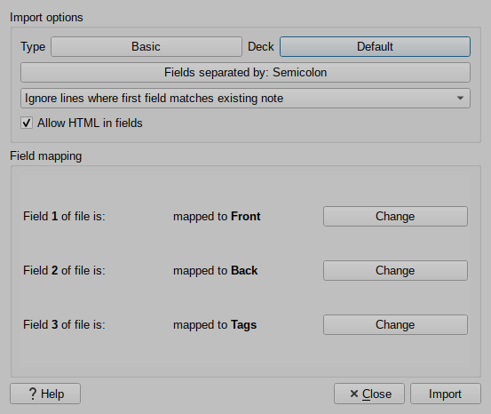
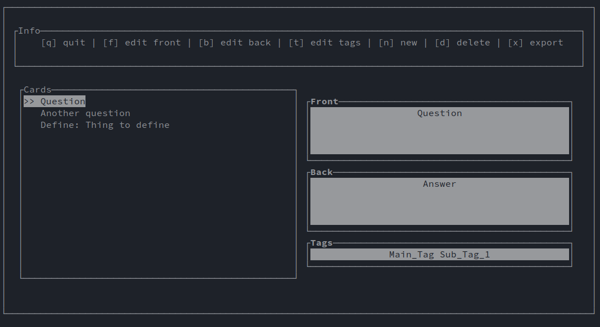

# Markdown to Anki converter
This is a command-line tool that converts markdown files into flashcards that can be imported using Anki. 

This tool was written in rust using the termion library.

## Running
1. Install Rust
2. run: `cargo run [path/to/input.md] [output_file_name]`

## To import in Anki
1. Press `Import File`
2. Select your outputted text file
3. Choose the settings shown below *(select the deck you want)r*



## Formatting

The markdown documents require specific formatting. For an example, see `example.md`.

Anything beneath a 'tag' will be turned into a card. For example:
```markdown
[](question)
- Question
  - Answer
```

Headings and subheadings are used to define the cards tags.
This formatting should keep the markdown looking nice when read.

## Commands
`q` - quit

`f` - edit front of selected card

`b` - edit back of selected card

`t` - edit tags of selected card

`<esc>` - finish editing

`n` - create a new card

`d` - delete selected card

`x` - export cards

`↑` - select above card

`↓` - select below card

## Screenshot

